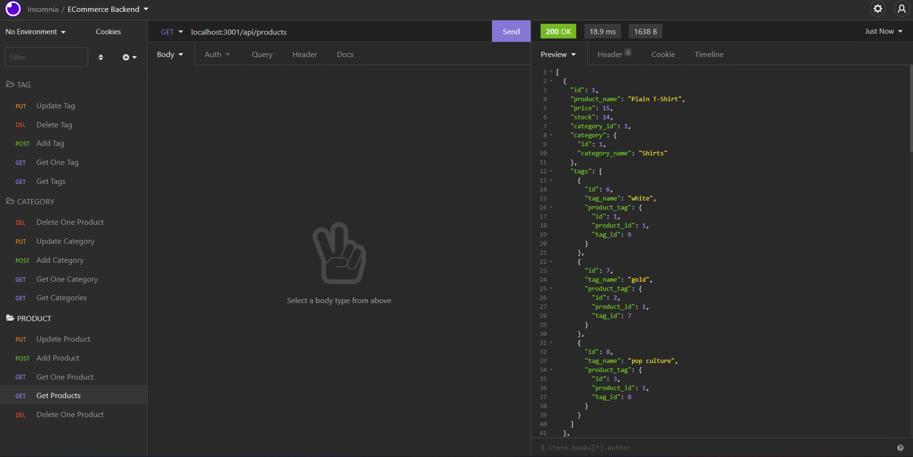

# The-E-Commerce-Backend

A Backend for an E-Commerce system that has been written in NodeJS with the aid of ExpressJS as a server/router, sequelize as an ORM for MySQL database. The operation was tested with Insomina.



## Table of Contents

* [Technologies](#technologies)
* [Installation](#installation)
* [Feature](#feature)
* [Usage](#usage)
* [License](#license)
* [Questions](#questions)
* [Screens](#screens)


## Technologies 

* JavaScript ES6
* Node.js
* npm
* MySQL
* mysql2
* Sequelize ORM
* Insomnia
* Nodemon

## Installation 

Following are the steps of installation

```
npm i
```

## Features

* Models for Products, categories and tags, with relationship models established via sequelize
* Organized ExpressJS request handling via routers
* Use of nodemon for saving and refreshing server instantly

## Usage 

Unrestricted usage.


## License 

None.

## Screens

This following gif shows the whole journey of the application.


Check video for demonstartion [here](https://youtu.be/aocVsGx5NkA)

## Questions 

If you have any more questions, please contact me here:

Github Username: [mohamedallam13](https://github.com/mohamedallam13)

Email: [mohamedallam.tu@gmail.com](mailto:mohamedallam.tu@gmail.com)


